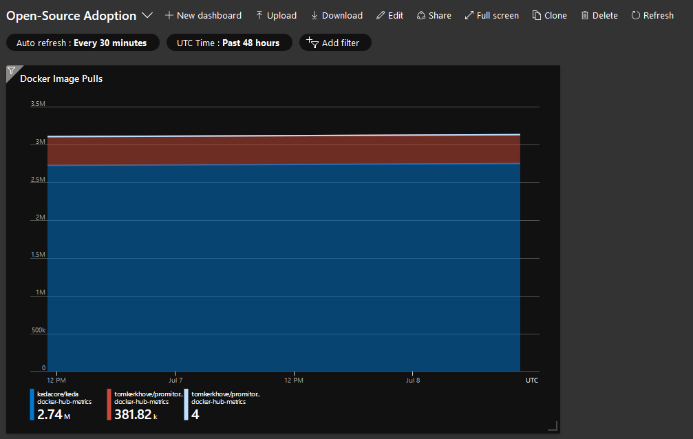

# Docker Hub Metrics Scraper
A scraper for Docker Hub metrics making the data available for analysis by reporting the following metrics in Azure Application Insights:

- `Image Pulls` - Amount of pulls for the image, regardless of the tag
- `Image Stars` - Amount of stars for the image

## How it works

An Azure Function will scrape Docker Hub API for every scrape request on a Service Bus queue and report the following metrics in Azure Application Insights.

We provide an Azure Logic App which you can deploy per repo and image to schedule scrapes and report them as multi-dimensional metrics.

## Deploying a scrape trigger

We provide an Azure Logic App which you can deploy per repo and image to schedule scrapes and report them as multi-dimensional metrics.

## License

This is licensed under The MIT License (MIT). Which means that you can use, copy, modify, merge, publish, distribute, sublicense, and/or sell copies of the web application. But you always need to state that Tom Kerkhove is the original author of this web application.
